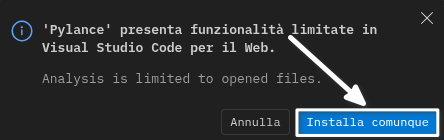
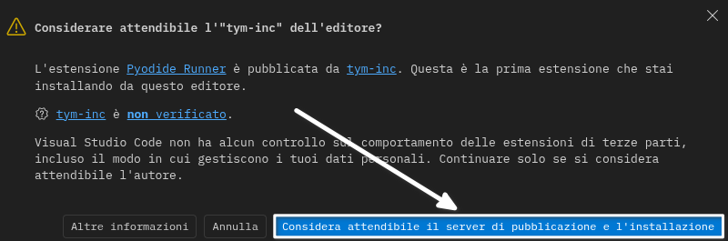
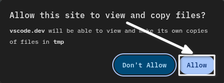
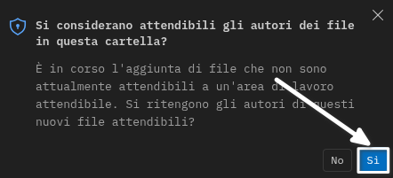
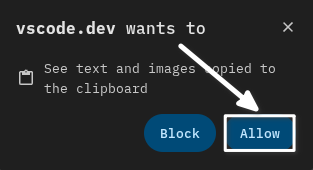
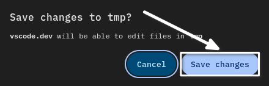
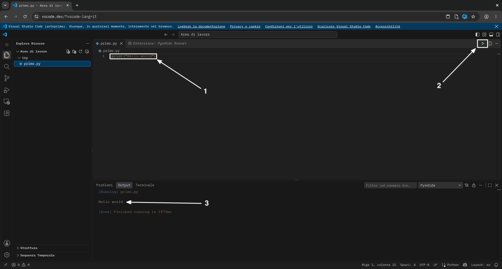

# Installare le estensioni

Nella barra delle attività a sinistra clicca l'icona delle **estensioni** (il simbolo del pacco).

Si apre il *Marketplace*: da qui installeremo gli strumenti che ci servono per programmare in Python.

---
layout: image-right
image: ./assets/01.png
---

# Cercare "Pylance"

Nel campo di ricerca del Marketplace digita **pylance**.

È l'estensione ufficiale di Microsoft per il supporto a Python (completamento, errori, suggerimenti). Clicca **Installa**.

---

# Installare comunque

Pylance, nella versione web, ha funzionalità limitate: l'analisi è ristretta ai file aperti.

Clicca **Installa comunque** per proseguire.

---
layout: image-right
image: ./assets/03.png
---

# Cercare "Pyodide Runner"

Ora cerca **pyodide runner** e clicca **Installa**.

Questa estensione permette di eseguire Python direttamente nel browser, senza installare nulla sul computer.

---

# Autore non verificato

Pyodide Runner è pubblicata da un autore non verificato: VS Code mostra un avviso di sicurezza.

Clicca **Considera attendibile il server di pubblicazione e l'installazione** per autorizzare l'estensione.

---
layout: image-right
image: ./assets/05.png
topic: VS Code Web · Workspace
---

# Aprire una cartella

Una cartella diventerà il vostro *workspace*, cioè lo spazio di lavoro in cui salverete i programmi.

Clicca l'icona dell'**Explorer** (le pagine) nella barra laterale a sinistra.

---
layout: image-right
image: ./assets/06.png
---

# Apri cartella

Nella vista dell'Explorer clicca **Apri cartella**.

Scegli una cartella sul tuo computer: il browser chiederà il permesso di accedervi.

---

# Consentire l'accesso ai file

Aprendo una cartella locale, il browser chiede il permesso di leggere i file.

Clicca **Allow** per permettere a vscode.dev di visualizzare e copiare i file della cartella.

---

# Autori attendibili

Subito dopo, VS Code chiede se si considerano attendibili gli autori dei file nella cartella.

Clicca **Sì**: l'autore dei file siete voi!

---

# Creare un file

Con il **tasto destro** sulla cartella scegli **Nuovo file** e chiamalo, ad esempio, `primo.py`.

Se compare la richiesta di accesso agli appunti, clicca **Allow**.

---

# Salvare le modifiche

Per salvare davvero i file nella cartella locale, il browser deve essere autorizzato a scrivere.

Clicca **Save changes**: così vscode.dev potrà scrivere sulla vostra cartella.

---
layout: center
class: text-center
topic: false
---

# Primo programma

Scrivi `print("Hello world")` nel file e premi il bottone **▶ Run** in alto a destra.

L'output `Hello world` comparirà nella console in basso.
